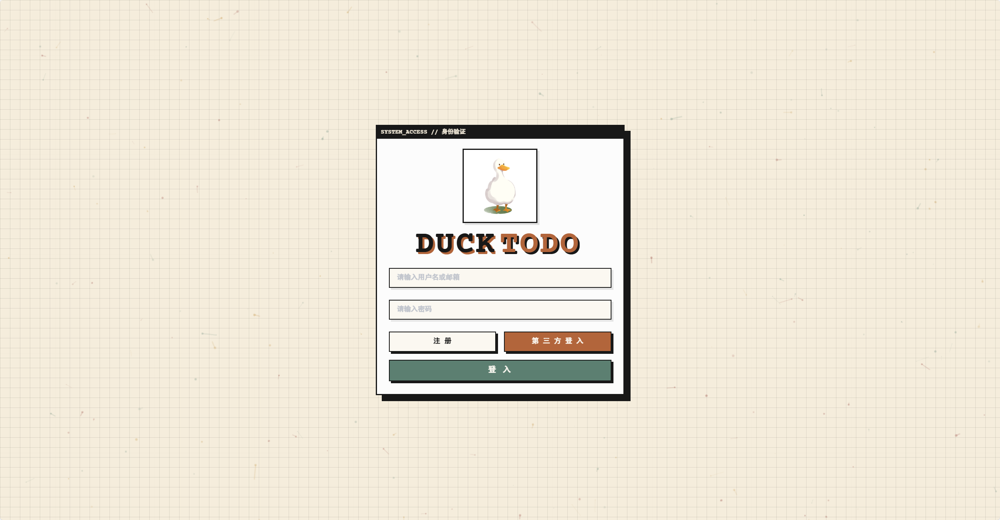
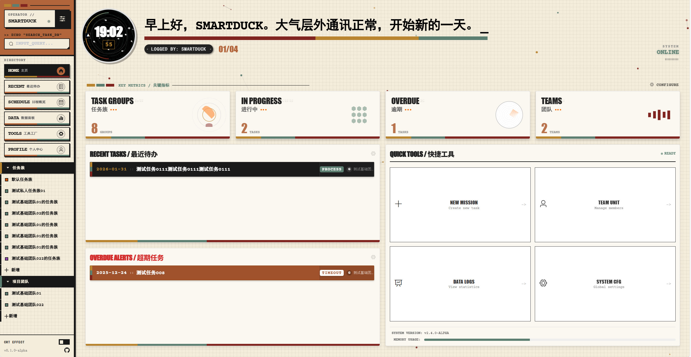
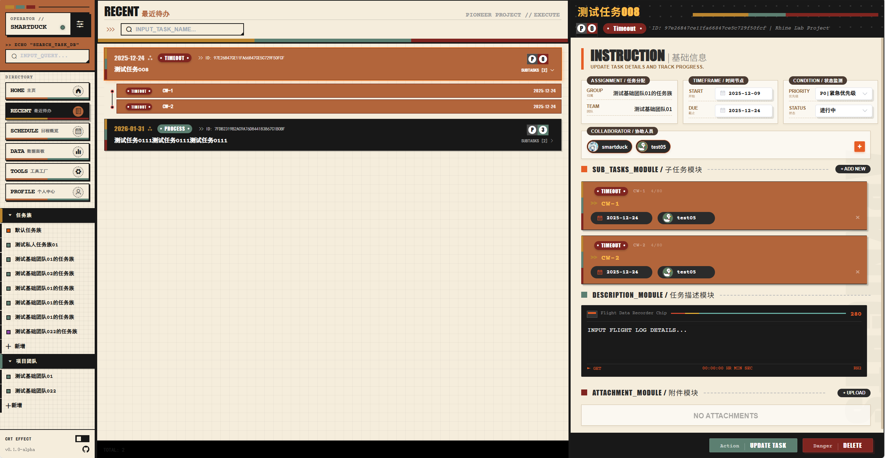
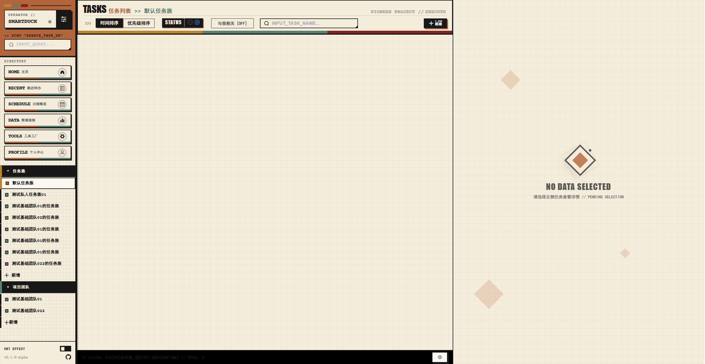
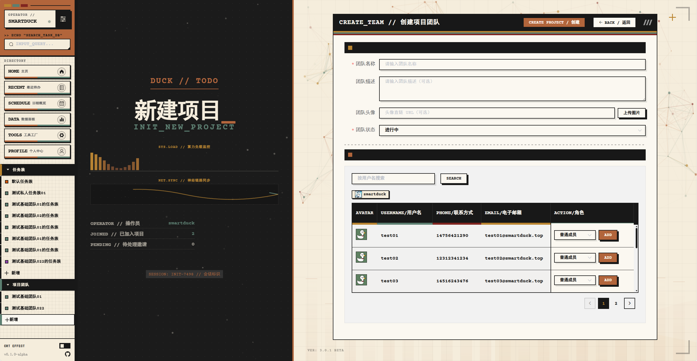
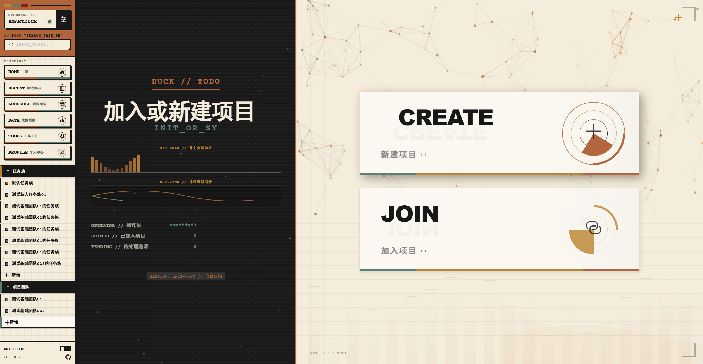
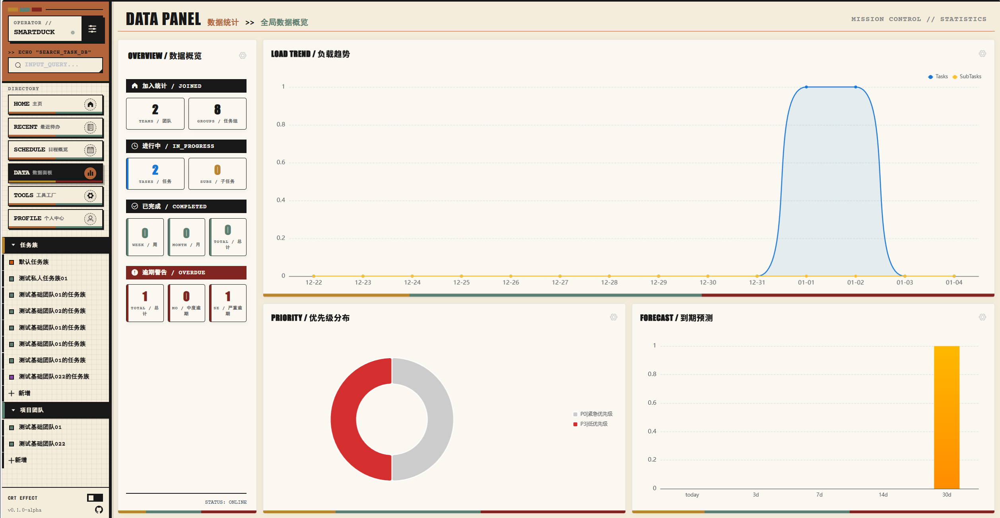
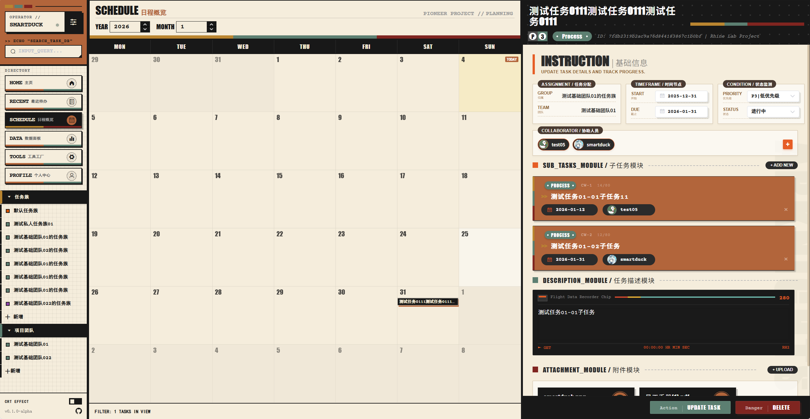
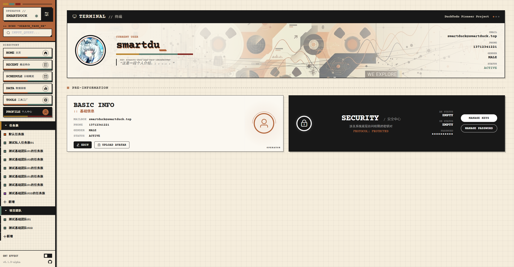

# DuckTodo

DuckTodo 是一个面向个人与小型团队的任务管理系统，采用前后端分离架构，支持任务族（项目）、任务、子任务、进度链、成员协作等功能，提供 JWT 与 AK/SK 两种鉴权方式，并集成 MinIO 存储头像等资源。

## ✨ 功能特性

### 核心功能
- **任务族管理**：支持私有任务族和团队任务族，支持颜色标记、别名自定义、拖拽排序
- **任务管理**：完整的任务生命周期管理，支持任务创建、编辑、删除、状态流转
- **子任务系统**：支持任务拆解为子任务，子任务独立状态管理和执行人指派
- **团队协作**：基于 RBAC 的权限体系（Owner/Manager/Member），支持成员邀请、角色管理
- **数据可视化**：集成 ECharts，提供负载趋势、任务活动、优先级分布、到期预报等图表
- **知识图谱**：基于 AntV X6 的任务图谱可视化，支持任务依赖关系展示

### 安全与集成
- **双重鉴权**：JWT Token 认证 + AK/SK API 密钥认证
- **密码安全**：Argon2 加盐哈希存储
- **AI 集成**：支持配置 LLM（OpenAI、ModelScope、Ollama 等）用于智能辅助
- **通知集成**：集成钉钉机器人，支持任务动态推送

### 数据统计
- **个人统计**：任务完成率、负载趋势、活跃度分析、平均响应时间（MTTR）
- **团队统计**：团队概览、成员负载、燃尽图、逾期分析、活跃度趋势

## 📸 界面预览

### 登录与注册


### 主页与任务管理




### 项目与团队




### 数据可视化



### 个人中心


## 🛠 技术栈

### 前端
- **框架**：Vue 2.6.14
- **路由**：Vue Router 3.5.1
- **状态管理**：Vuex 3.6.2
- **UI 组件库**：Element UI 2.15.14
- **图表库**：ECharts 6.0.0
- **图谱可视化**：AntV X6 3.0.0
- **HTTP 客户端**：Axios 1.13.1
- **构建工具**：@vue/cli-service 5.0.0

### 后端
- **框架**：Spring Boot 3.3.0
- **Java 版本**：JDK 21
- **安全框架**：Spring Security（认证与授权）
- **ORM**：MyBatis-Plus 3.5.7
- **数据库**：MySQL 8.0
- **对象存储**：MinIO 8.5.10
- **工具库**：Hutool 5.8.27
- **JWT**：jjwt 0.12.5
- **API 文档**：Knife4j 4.5.0（OpenAPI 3）
- **AI 集成**：Spring AI 1.0.0-M1（OpenAI）

## 📁 项目结构

```
DuckTodo/
├── backend/                 # 后端源码（Spring Boot）
│   ├── src/main/java/      # Java 源码
│   ├── src/main/resources/ # 配置文件与数据库 Schema
│   └── pom.xml            # Maven 依赖配置
├── frontend/               # 前端源码（Vue 2）
│   ├── src/               # Vue 源码
│   ├── public/            # 静态资源
│   └── package.json       # NPM 依赖配置
├── docs/                   # 项目文档
│   ├── api/               # API 接口文档
│   ├── design/            # 设计文档（架构、需求、功能）
│   └── sql/               # 数据库设计文档
├── docker/                 # Docker 相关配置
│   ├── Dockerfile         # 容器构建文件
│   └── nginx.conf         # Nginx 配置
├── docker-compose.yml      # Docker Compose 编排
├── env.example            # 环境变量示例
└── README.md              # 项目说明文档
```

## 🚀 快速开始

### 前置要求
- **后端**：JDK 21+、Maven 3.6+、MySQL 8.0+、MinIO（或兼容 S3 的对象存储）
- **前端**：Node.js 16+、npm 或 pnpm

### 后端启动

1. **配置数据库和 MinIO**
   
   复制 `backend/src/main/resources/application-dev.yml` 或通过环境变量配置：
   ```yaml
   spring:
     datasource:
       url: jdbc:mysql://localhost:3306/ducktodo?useSSL=false&serverTimezone=UTC&characterEncoding=utf8
       username: root
       password: your_password
       driver-class-name: com.mysql.cj.jdbc.Driver
   minio:
     endpoint: http://localhost:9000
     access-key: minioadmin
     secret-key: minioadmin
     bucket: ducktodo
     ensure-bucket: true
   jwt:
     secret: your-jwt-secret-key
     expire-seconds: 86400
   ```

2. **数据库自动初始化**
   
   后端启动时会自动检测并创建所需表结构（需要数据库账号具备 `CREATE TABLE` 权限）。初始化过程会输出详细日志（`[DB-Init] ...`）。

3. **启动服务**
   ```bash
   cd backend
   mvn spring-boot:run
   ```
   
   默认运行在 `http://localhost:8080`

4. **生产环境构建**
   ```bash
   mvn -DskipTests -Dspring.profiles.active=prod clean package
   java -jar target/DuckTodo-0.0.1-SNAPSHOT.jar --spring.profiles.active=prod
   ```

### 前端启动

1. **安装依赖**
   ```bash
   cd frontend
   npm install
   # 或使用 pnpm
   pnpm install
   ```

2. **开发启动**
   ```bash
   npm run serve
   ```
   
   默认运行在 `http://localhost:8081`，已配置代理将 `/api` 转发到后端 `http://localhost:8080`

3. **生产构建**
   ```bash
   npm run build
   ```
   
   构建产物在 `dist/` 目录

## 🔐 鉴权与安全

### JWT 认证
- **请求头注入**：`Authorization: Bearer <token>` 或 `token: <token>`
- **自动刷新**：后端拦截器在鉴权成功后下发新令牌到响应头，前端自动更新 `localStorage`
- **401 处理**：未授权时前端自动清理令牌并跳转登录页

### AK/SK 认证
- **请求头**：`access_token: <AK>` 与 `secret_Token: <SK>`
- **用途**：适用于服务集成、自动化脚本、API 调用等场景
- **管理**：用户可在个人中心生成和管理 AK/SK

### 安全特性
- **密码加密**：Argon2 加盐哈希存储
- **权限控制**：基于 RBAC 的细粒度权限管理
- **状态码规范**：权限相关错误统一返回 400（BAD_REQUEST），禁止使用 403

## 📚 文档导航

### API 接口文档
所有接口文档位于 `docs/api/` 目录：

- **[接口说明文档目录](./docs/api/接口说明文档目录.md)** - API 文档总览
- **[Base 基础模块](./docs/api/base接口说明文档.md)** - 登录、注册、登出、健康检查
- **[User 用户模块](./docs/api/user接口说明文档.md)** - 用户信息、密码修改、头像上传、AK/SK 管理
- **[Team 团队模块](./docs/api/team接口说明文档.md)** - 团队创建、成员管理、邀请处理
- **[TaskGroup 任务族模块](./docs/api/taskgroup接口说明文档.md)** - 任务族创建、更新、删除、排序
- **[Task 任务模块](./docs/api/task接口说明文档.md)** - 任务 CRUD、子任务管理、附件、审计日志
- **[Statistics 统计模块](./docs/api/statistics接口说明文档.md)** - 个人/团队数据统计、趋势分析
- **[LLM Config 配置](./docs/api/llmconfig接口说明文档.md)** - LLM 模型配置管理
- **[DingTalk Config 配置](./docs/api/dingtalkconfig接口说明文档.md)** - 钉钉机器人配置管理

### 设计文档
设计文档位于 `docs/design/` 目录：

- **[技术架构](./docs/design/技术架构.md)** - 系统架构设计、技术选型、分层架构
- **[需求分析](./docs/design/需求分析.md)** - 功能需求详细说明
- **[系统功能架构](./docs/design/系统功能架构.md)** - 核心功能模块设计
- **[接口文档](./docs/design/接口文档.md)** - 完整接口说明（按控制器分组）
- **[权限管控](./docs/design/权限管控.md)** - RBAC 权限模型说明
- **[后端开发规范](./docs/design/后端开发project%20rules.md)** - 后端开发规范与最佳实践

### 数据库文档
数据库设计文档位于 `docs/sql/` 目录：

- **[数据库设计](./docs/sql/database.md)** - 完整的数据字典和 DDL
- **[数据库 ER 图](./docs/sql/database-er.md)** - 实体关系图

## 🐳 Docker 部署

### Docker Compose（推荐）

1. **配置环境变量**
   ```bash
   cp env.example .env
   # 编辑 .env 文件，填写数据库、MinIO、JWT 等配置
   # ⚠️ 重要：请务必修改默认密码和密钥，不要使用示例值
   ```

2. **启动服务**
   ```bash
   docker-compose up -d
   ```

3. **访问应用**
   - 前端：`http://localhost:8080`（根据 `HOST_HTTP_PORT` 配置）
   - API 文档：`http://localhost:8080/doc.html`（Knife4j）
   - 后端 API 直连：`http://localhost:8081`（根据 `HOST_API_PORT` 配置）

**环境变量说明**：
- `env.example` 文件仅包含示例配置，所有敏感信息（密码、密钥）均为示例值
- 生产环境请务必修改 `.env` 文件中的 `MYSQL_PASSWORD`、`MINIO_SECRET_KEY`、`JWT_SECRET` 等敏感配置
- `.env` 文件已被 `.gitignore` 忽略，不会提交到代码仓库

### Docker 镜像构建

使用 `docker/Dockerfile` 构建镜像：
```bash
docker build --build-arg JAR_FILE=backend/target/DuckTodo-0.0.1-SNAPSHOT.jar --build-arg FRONTEND_DIR=frontend/dist -t ducktodo:latest -f docker/Dockerfile .
docker run -d -p 8080:80 ducktodo:latest
```

**注意**：构建时需要指定后端 JAR 文件路径和前端构建目录路径。

## 🔧 开发说明

### CI/CD 流水线

项目包含 Jenkins 流水线配置（`Jenkinsfile`），支持自动化构建和部署：

1. **Checkout**：从 Git 仓库拉取代码
2. **Build Backend**：构建 Spring Boot 应用（Maven）
3. **Build Frontend**：构建 Vue 前端应用（NPM）
4. **Build Docker Image**：构建 Docker 镜像
5. **Push to Harbor**：推送镜像到 Harbor 镜像仓库

**注意**：Jenkinsfile 中的敏感信息（Git 凭证、Harbor 凭证）通过 Jenkins 凭证管理，不直接硬编码在文件中。

### 前端开发
- **代理配置**：见 `frontend/vue.config.js`，开发环境自动代理 `/api` 到后端
- **HTTP 拦截器**：见 `frontend/src/utils/http.js`，统一处理 Token 注入、响应解析、错误提示
- **主题样式**：使用 `theme.css` 统一管理主题变量，支持"磁带复古主义"（Tape Futurism）风格

### 后端开发
- **统一返回结构**：所有接口返回 `R<T>`（`success/code/message/data/timestamp`）
- **状态码规范**：
  - `200`：成功
  - `400`：参数错误或权限不足（权限相关错误统一使用 400，禁止使用 403）
  - `401`：未认证
  - `404`：资源不存在
  - `500`：服务器内部错误
- **数据库初始化**：启动时自动检测并创建表结构（`DatabaseInitializer`）
- **API 文档**：访问 `/doc.html` 查看 Knife4j 文档，或 `/v3/api-docs` 获取 OpenAPI JSON

## 📊 数据库表结构

核心表包括：
- `user` - 用户表
- `user_security` - 用户安全信息（密码、AK/SK）
- `team` - 团队表
- `team_user_relation` - 团队成员关系表
- `task_group` - 任务族表
- `task_group_user_relation` - 任务族成员关系表
- `task` - 任务表
- `task_user_relation` - 任务用户关系表（拥有者/协助者）
- `child_task` - 子任务表
- `task_file` - 任务附件表
- `task_node` - 任务图谱节点表
- `task_edge` - 任务图谱边表
- `task_audit` - 任务审计日志表
- `user_llm_config` - LLM 配置表
- `user_dingtalk_robot` - 钉钉机器人配置表

完整表结构见 `docs/sql/database.md`

## 🚨 常见问题

### 后端问题
- **数据库连接失败**：检查 `application-dev.yml` 配置，确认数据库服务运行正常
- **表初始化失败**：确保数据库账号具备 `CREATE TABLE` 权限，查看启动日志中的 `[DB-Init]` 输出
- **MinIO 连接失败**：确认 MinIO 服务运行正常，检查 `minio.endpoint` 配置
- **401 未授权**：确认请求头携带 `Authorization: Bearer <token>` 或使用 AK/SK 头部
- **权限错误返回 400**：权限相关错误统一返回 400（BAD_REQUEST）状态码，这是预期行为

### 前端问题
- **API 请求失败**：检查 `vue.config.js` 中的代理配置，确认后端服务运行在正确端口
- **Token 过期**：前端会自动处理 Token 刷新，如仍失败请检查后端 JWT 配置
- **构建失败**：清除 `node_modules` 和 `package-lock.json` 后重新安装依赖

### Docker 部署问题
- **环境变量未生效**：确认 `.env` 文件存在且格式正确，检查 `docker-compose.yml` 中的环境变量映射
- **端口冲突**：修改 `env.example` 中的 `HOST_HTTP_PORT` 和 `HOST_API_PORT` 避免端口冲突
- **镜像构建失败**：确认构建参数 `JAR_FILE` 和 `FRONTEND_DIR` 路径正确

## 🤝 贡献指南

1. Fork 本项目
2. 创建特性分支 (`git checkout -b feature/AmazingFeature`)
3. 提交更改 (`git commit -m 'Add some AmazingFeature'`)
4. 推送到分支 (`git push origin feature/AmazingFeature`)
5. 开启 Pull Request

## 📝 许可证

本项目采用 MIT 许可证。

## 📧 联系方式

如有问题或建议，请通过 Issue 反馈。

---

**DuckTodo** - 让任务管理更简单、更高效 🦆
