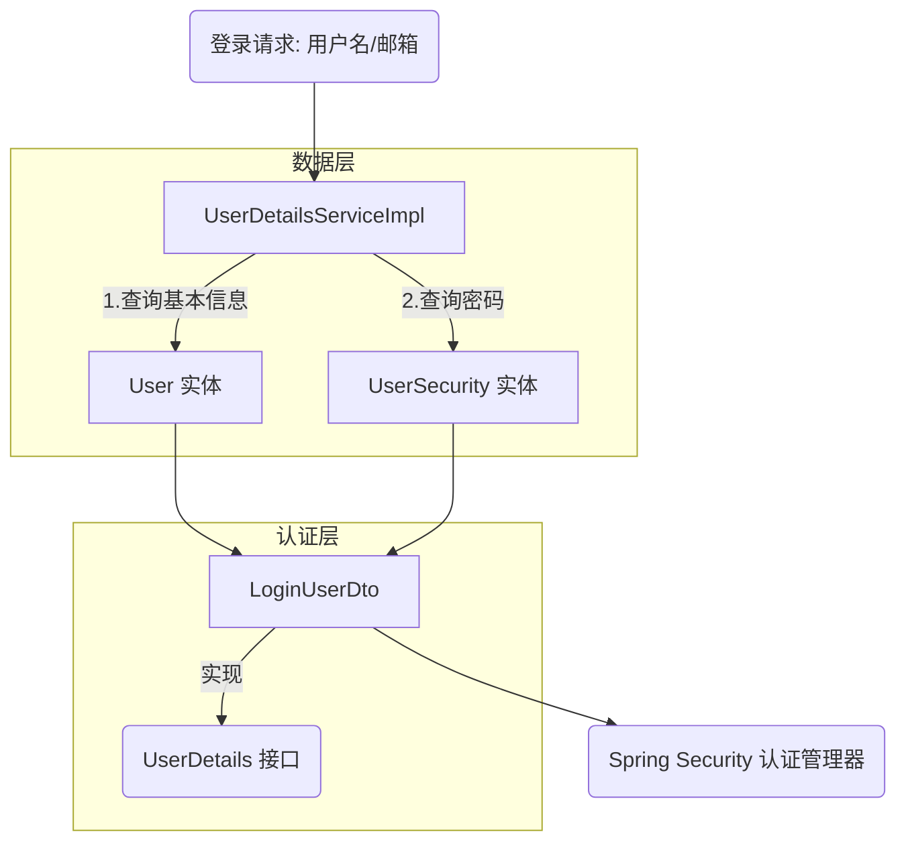

# 用户认证模型与类关系详解

本文档详细解析后端项目中 `User`、`UserSecurity`、`LoginUserDto` 与 `UserDetailsServiceImpl` 之间的核心关系与协作机制。这四个类共同构成了基于 Spring Security 的用户认证与授权体系。

## 1. 核心关系图解

**`UserDetailsServiceImpl`** 是组装工厂，它从数据库中分别查询 **`User`**（基本信息）和 **`UserSecurity`**（密码信息），并将它们组装成一个 **`LoginUserDto`** 对象，供 Spring Security 进行身份验证。

---

## 2. 详细职责说明

### 2.1. `User` (数据库实体)
*   **定位**: 对应数据库 `user` 表。
*   **职责**: 仅存储用户的**公开/业务属性**（如用户名、邮箱、头像、手机号等）。
*   **特点**: **不包含密码**。这样做是为了安全设计，防止在一般的业务查询中意外泄露密码字段。

### 2.2. `UserSecurity` (数据库实体)
*   **定位**: 对应数据库 `user_security` 表。
*   **职责**: 专门存储用户的**敏感安全信息**（如加密后的密码、密码盐、AccessKey/SecretKey 等）。
*   **关系**: 通过 `user_id` 与 `User` 表形成一对一关系。

### 2.3. `LoginUserDto` (认证对象)
*   **定位**: Spring Security 的 `UserDetails` 接口实现类。
*   **职责**: 作为 Spring Security 内部通用的用户载体。它**聚合**了业务数据与认证数据。
*   **结构**:
    *   包含一个 `User` 对象：方便在认证后直接获取用户 ID、昵称等信息。
    *   包含 `password` 字段：从 `UserSecurity` 中提取，用于通过 Spring Security 的密码校验。

### 2.4. `UserDetailsServiceImpl` (组装服务)
*   **定位**: Spring Security 的 `UserDetailsService` 接口实现类。
*   **职责**: 定义“如何从数据库加载用户”的逻辑。
*   **工作流程**:
    1.  接收登录请求传入的 `username`。
    2.  调用 `UserService` 查找 `User` 表（支持用户名或邮箱匹配）。
    3.  拿到 `userId` 后，调用 `UserSecurityService` 查找 `UserSecurity` 表获取密码。
    4.  将两者组合，`new LoginUserDto(user, security.getUserPassword())` 并返回。

## 3. 设计总结

这种设计采用了**信息分离原则**：

1.  **数据层分离**：将高频访问且低敏感的“用户信息”与低频访问且高敏感的“安全信息”在数据库层面拆分。
2.  **按需聚合**：仅在认证环节通过 `UserDetailsServiceImpl` 和 `LoginUserDto` 进行临时聚合，既保证了认证所需的完整性，又确保了日常业务查询的安全性。
