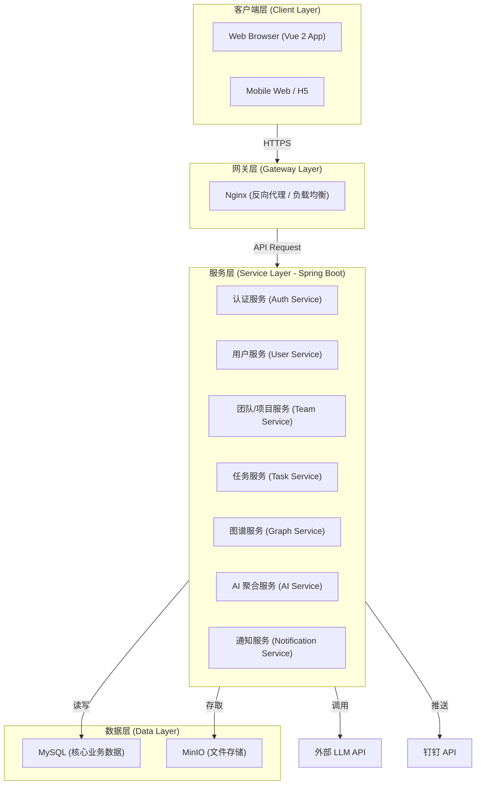

# DuckTodo 技术架构文档

## 1. 架构设计原则
*   **前后端分离**: 采用 RESTful API 进行通信，确保前端与后端的解耦。
*   **安全性优先**: 全链路数据加密，严格的权限控制 (RBAC)。
*   **高可用与扩展性**: 支持水平扩展，适应业务增长。

## 2. 技术栈选型

### 2.1 前端 (Frontend)
*   **框架**: Vue 2 + JavaScript
*   **构建工具**: Webpack / Vite (Vue 2 插件)
*   **状态管理**: Vuex
*   **UI 组件库**: Element UI (定制版)
*   **图可视化**: ECharts (常规图表) / AntV X6 (任务图谱)
*   **数据请求**: Axios

### 2.2 后端 (Backend)
*   **运行时**: Java (JDK 17+)
*   **框架**: Spring Boot 3.x
*   **安全框架**: Spring Security (提供认证与授权)
*   **ORM**: MyBatis-Plus
*   **API 文档**: Knife4j / Swagger (OpenAPI)

### 2.3 数据库与存储 (Data & Storage)
*   **关系型数据库**: MySQL 8.0 (存储用户、任务、项目等核心数据)
*   **文件存储**: MinIO (自建对象存储)

### 2.4 AI 与集成 (AI & Integration)
*   **LLM 接入**: Spring AI (对接 OpenAI, Ollama 等模型)
*   **消息推送**: DingTalk Robot API (WebHook)

## 3. 系统分层架构

## 4. 核心模块设计

### 4.1 认证与授权
*   **认证**: 基于 Spring Security + JWT 的无状态认证机制。
*   **授权**: 基于 RBAC (Role-Based Access Control) 模型，使用 Spring Security 的注解 (`@PreAuthorize`) 进行细粒度权限控制。
*   **密码安全**: 使用 Argon2 算法对用户密码进行加盐哈希存储。

### 4.2 任务流转引擎
*   **状态机**: 在 Service 层实现有限状态机，控制任务状态流转合法性。
*   **并发控制**: 使用数据库事务 (Transaction) 或乐观锁 (Optimistic Locking) 处理多人协作冲突。

### 4.3 实时通信 (可选)
*   **WebSocket**: 使用 Socket.io 实现任务状态变更的实时推送、在线协作通知。

### 4.4 图谱构建
*   **存储策略**: 节点 (Node) 和边 (Edge) 存储在关系型数据库中，通过邻接表或闭包表设计支持快速查询。
*   **布局算法**: 前端使用图形库 (如 AntV X6) 进行渲染和交互，后端负责节点数据的 CRUD 和关联关系的维护。

## 5. 具体依赖包 (Dependencies)

### 5.1 前端 (Frontend)
*   `vue`: ^2.7.x
*   `vuex`: ^3.6.x
*   `vue-router`: ^3.6.x
*   `axios`: ^1.x
*   `element-ui`: ^2.15.x
*   `echarts`: ^5.x (实际项目已引入 ^6.0.0)
*   `@antv/x6`: ^2.x (规划中)
*   `sass`: ^1.x (规划中)
*   `core-js`: ^3.x (现有依赖)

### 5.2 后端 (Backend)
*   `org.springframework.boot:spring-boot-starter-web`
*   `org.springframework.boot:spring-boot-starter-security` (规划中)
*   `org.springframework.ai:spring-ai-openai-spring-boot-starter` (规划中)
*   `com.baomidou:mybatis-plus-boot-starter`
*   `com.mysql:mysql-connector-j`
*   `io.minio:minio`
*   `com.github.xiaoymin:knife4j-openapi3-jakarta-spring-boot-starter` (规划中)
*   `org.bouncycastle:bcprov-jdk15on`
*   `io.jsonwebtoken:jjwt`
*   `org.projectlombok:lombok` (现有依赖)
*   `cn.hutool:hutool-all` (现有依赖)

## 6. 现有项目现状与升级路线 (Gap Analysis)
*   **JDK 版本**: 现有项目使用 JDK 21，架构一致。
*   **Spring Boot**: 现有版本 3.3.0，架构一致。
*   **缺失模块**: 现有项目已配置 Spring Security, Spring AI 及 Knife4j 依赖，待实现具体业务逻辑。
*   **前端差异**: 现有项目使用 Vue 2.6.14，架构规划建议升级至 Vue 2.7.x 以获得更好的 TypeScript 支持（可选），并补充 AntV X6 图谱库。

## 7. 部署架构
*   **容器化**: 使用 Docker 对应用进行容器化封装。
*   **编排**: Docker Compose (单机) 或 K8s (集群) 进行服务编排。
*   **CI/CD**: GitHub Actions 或 Jenkins 实现自动化构建与部署。

## 8. 安全设计
*   **数据传输**: 全站 HTTPS 加密。
*   **敏感数据**: 数据库敏感字段 (如 AK/SK) 加密存储。
*   **防护**: API 限流 (Rate Limiting)、防 SQL 注入、XSS/CSRF 防护。
