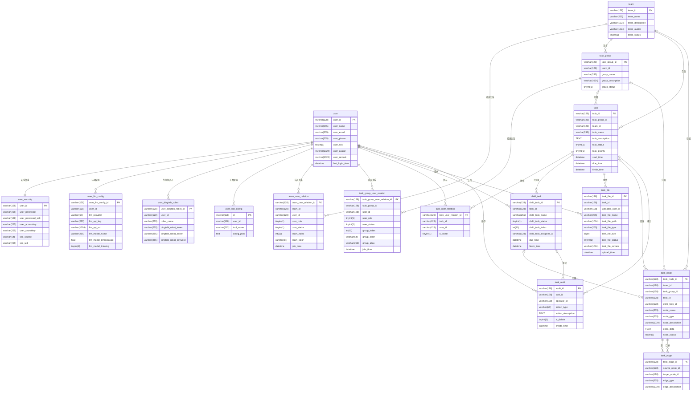

```mermaid
erDiagram
    user {
        varchar(128) user_id PK
        varchar(255) user_name
        varchar(255) user_email
        varchar(255) user_phone
        tinyint(1) user_sex
        varchar(1024) user_avatar
        varchar(1024) user_remark
        datetime last_login_time
    }
    user_security {
        varchar(128) user_id PK
        varchar(255) user_password
        varchar(128) user_password_salt
        varchar(255) user_accesskey
        varchar(255) user_secretkey
        varchar(64) sso_source
        varchar(255) sso_uid
    }
    user_llm_config {
        varchar(128) user_llm_config_id PK
        varchar(128) user_id
        varchar(64) llm_provider
        varchar(255) llm_api_key
        varchar(1024) llm_api_url
        varchar(255) llm_model_name
        float llm_model_temperature
        tinyint(1) llm_model_thinking
    }
    user_dingtalk_robot {
        varchar(128) user_dingtalk_robot_id PK
        varchar(128) user_id
        varchar(255) robot_name
        varchar(255) dingtalk_robot_token
        varchar(255) dingtalk_robot_secret
        varchar(255) dingtalk_robot_keyword
    }
    user_tool_config {
        varchar(128) id PK
        varchar(128) user_id
        varchar(512) tool_name
        text config_json
    }
    team {
        varchar(128) team_id PK
        varchar(255) team_name
        varchar(1024) team_description
        varchar(1024) team_avatar
        tinyint(1) team_status
    }
    team_user_relation {
        varchar(128) team_user_relation_id PK
        varchar(128) team_id
        varchar(128) user_id
        tinyint(1) user_role
        tinyint(1) user_status
        int(11) team_index
        varchar(64) team_color
        datetime join_time
    }
    task_group {
        varchar(128) task_group_id PK
        varchar(128) team_id
        varchar(255) group_name
        varchar(1024) group_description
        tinyint(1) group_status
    }
    task_group_user_relation {
        varchar(128) task_group_user_relation_id PK
        varchar(128) task_group_id
        varchar(128) user_id
        tinyint(1) user_role
        tinyint(1) user_status
        int(11) group_index
        varchar(64) group_color
        varchar(255) group_alias
        datetime join_time
    }
    task {
        varchar(128) task_id PK
        varchar(128) task_group_id
        varchar(128) team_id
        varchar(255) task_name
        TEXT task_description
        tinyint(1) task_status
        tinyint(1) task_priority
        datetime start_time
        datetime due_time
        datetime finish_time
    }
    task_user_relation {
        varchar(128) task_user_relation_id PK
        varchar(128) task_id
        varchar(128) user_id
        tinyint(1) if_owner
    }
    child_task {
        varchar(128) child_task_id PK
        varchar(128) task_id
        varchar(255) child_task_name
        tinyint(1) child_task_status
        int(11) child_task_index
        varchar(128) child_task_assignee_id
        datetime due_time
        datetime finish_time
    }
    task_file {
        varchar(128) task_file_id PK
        varchar(128) task_id
        varchar(128) uploader_user_id
        varchar(255) task_file_name
        varchar(1024) task_file_path
        varchar(255) task_file_type
        bigint task_file_size
        tinyint(1) task_file_status
        varchar(1024) task_file_remark
        datetime upload_time
    }
    task_node {
        varchar(128) task_node_id PK
        varchar(128) team_id
        varchar(128) task_group_id
        varchar(128) task_id
        varchar(128) child_task_id
        varchar(255) node_name
        varchar(255) node_type
        varchar(1024) node_description
        TEXT extra_data
        tinyint(1) node_status
    }
    task_edge {
        varchar(128) task_edge_id PK
        varchar(128) source_node_id
        varchar(128) target_node_id
        varchar(255) edge_type
        varchar(1024) edge_description
    }
    task_audit {
        varchar(128) audit_id PK
        varchar(128) task_id
        varchar(128) operator_id
        varchar(64) action_type
        TEXT action_description
        tinyint(1) is_delete
        datetime create_time
    }

    user ||--|| user_security : 安全信息
    user ||--o{ user_llm_config : LLM配置
    user ||--o{ user_dingtalk_robot : 钉钉机器人
    user ||--o{ user_tool_config : 工具配置
    team ||--o{ team_user_relation : 成员关系
    user ||--o{ team_user_relation : 成员关系
    team ||--o{ task_group : 包含
    task_group ||--o{ task_group_user_relation : 成员关系
    user ||--o{ task_group_user_relation : 成员关系
    team ||--o{ task : 包含
    task_group o|--o{ task : 归属
    task ||--o{ task_user_relation : 协作
    user ||--o{ task_user_relation : 参与
    task ||--o{ child_task : 子任务
    user o|--o{ child_task : 指派
    task ||--o{ task_file : 附件
    user ||--o{ task_file : 上传
    team o|--o{ task_node : 归属
    task_group o|--o{ task_node : 归属
    task o|--o{ task_node : 归属
    child_task o|--o{ task_node : 归属
    task_node ||--o{ task_edge : 源
    task_node ||--o{ task_edge : 目标
    task ||--o{ task_audit : 审计
    child_task o|--o{ task_audit : 审计
    user ||--o{ task_audit : 操作
```
